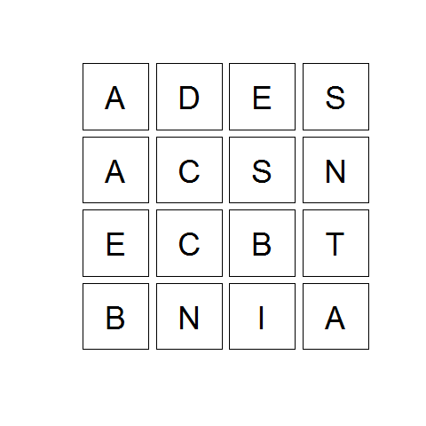
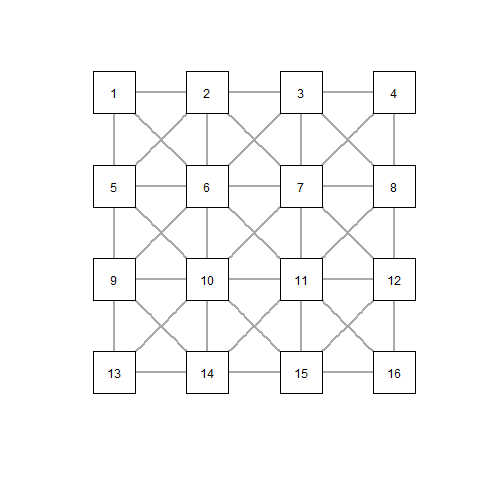

# Boggler
### Generate solutions and play Boggle (in English, French or Finnish)

Added support for Finnish language ("fi")

#### Getting Started
First, install the package:

```r
library(devtools)
install_github("jtuimala/Boggler")
```

Next, just use one of `Play.Boggle()` or `Solve.Boggle()` functions, specifying the language as argument. That's it!

#### What to expect
When you use `Play.Boggle()`, the letters are shuffled and you get a plot looking like this one:


Behind the scenes, letters are connected via an igraph:


#### Et puis après?
```r
> Play.Boggle("fr") # use "en" for English
Veuillez patienter pendant la recherche des solutions...

1: ait
+1pt(s) (temps restant: 99 secs)

1: 
```

At the end, you get your score, as well as the maximum possible score.

To get the list of all possible words, just proceed like this:

```r
> solutions <- Play.Boggle()
...
> head(solutions$solutions)
  word pts
1  ada   1
2  ace   1
3  des   1
4  dec   1
5  est   1
6  sec   1
> tail(solutions$solutions)
       word pts
81   absent   3
82  destine   5
83  dentine   5
84  sentine   5
85  accents   5
86 centaine  11
```

Or, if you forgot to assign the results to a variable:

```r
> Play.Boggle()
...
> tail(.Last.value$solutions)
       word pts
81   absent   3
82  destine   5
83  dentine   5
84  sentine   5
85  accents   5
86 centaine  11
```
